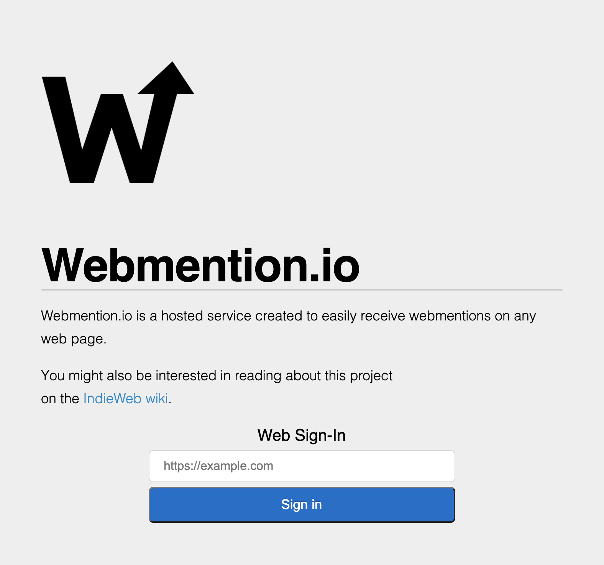
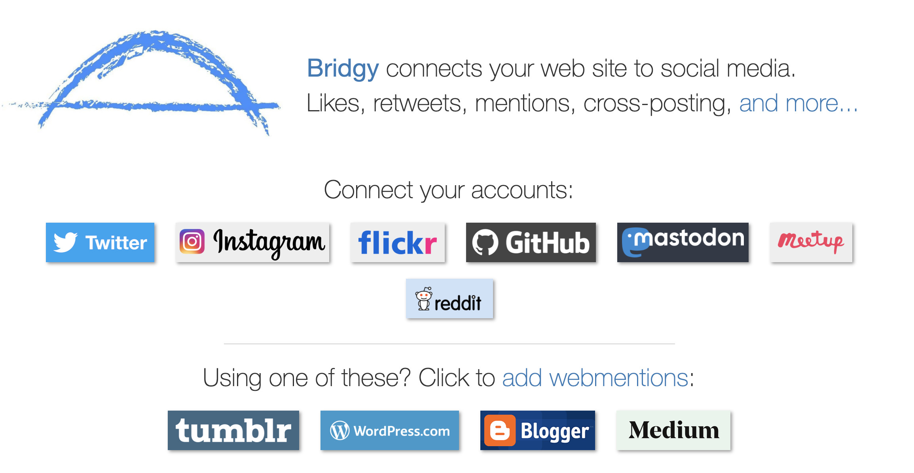
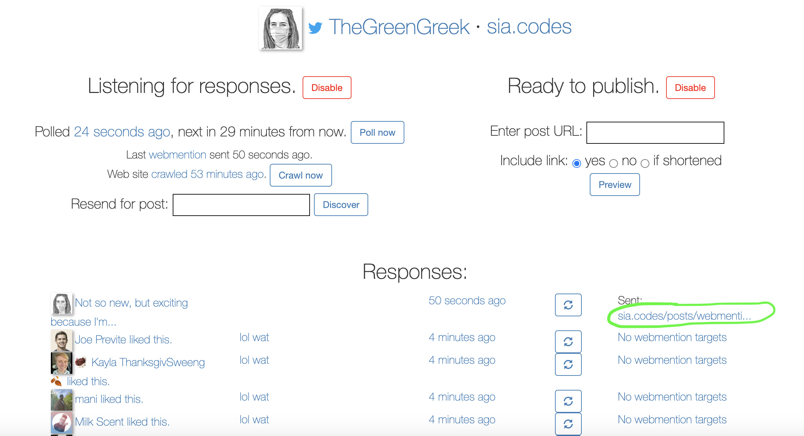
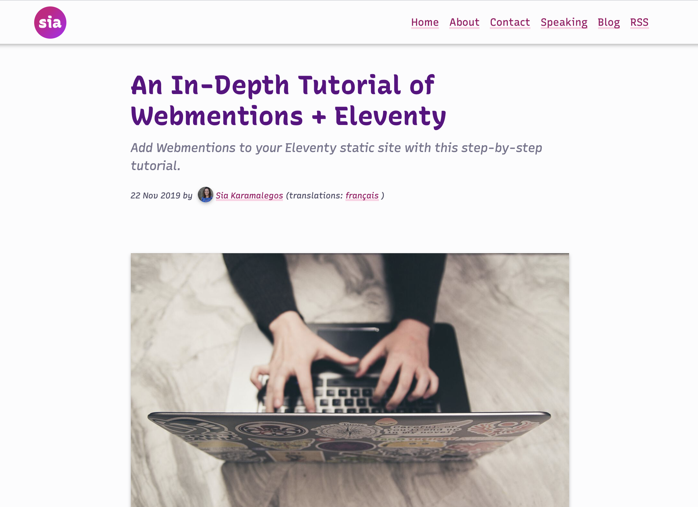
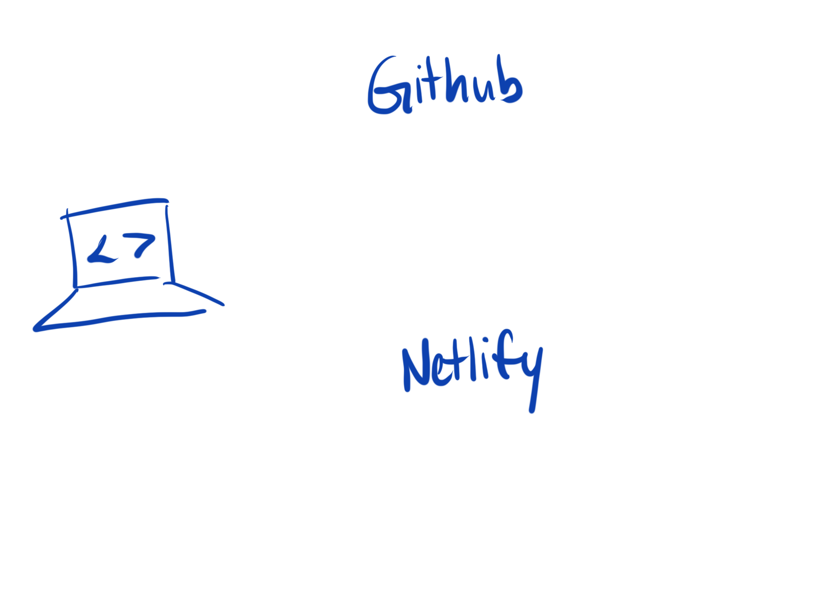
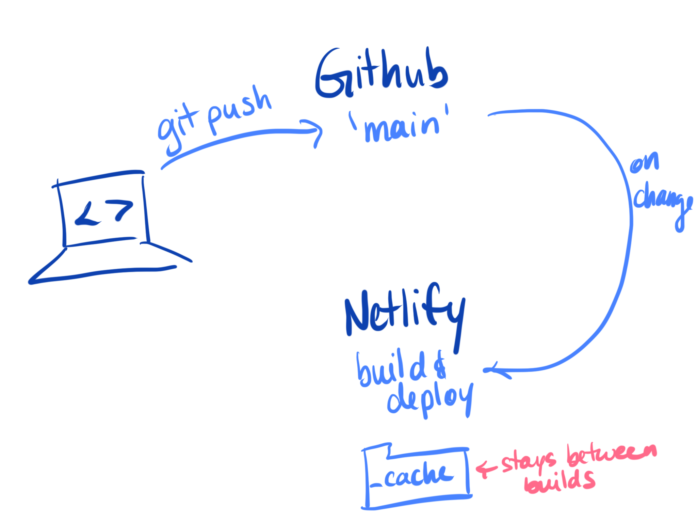
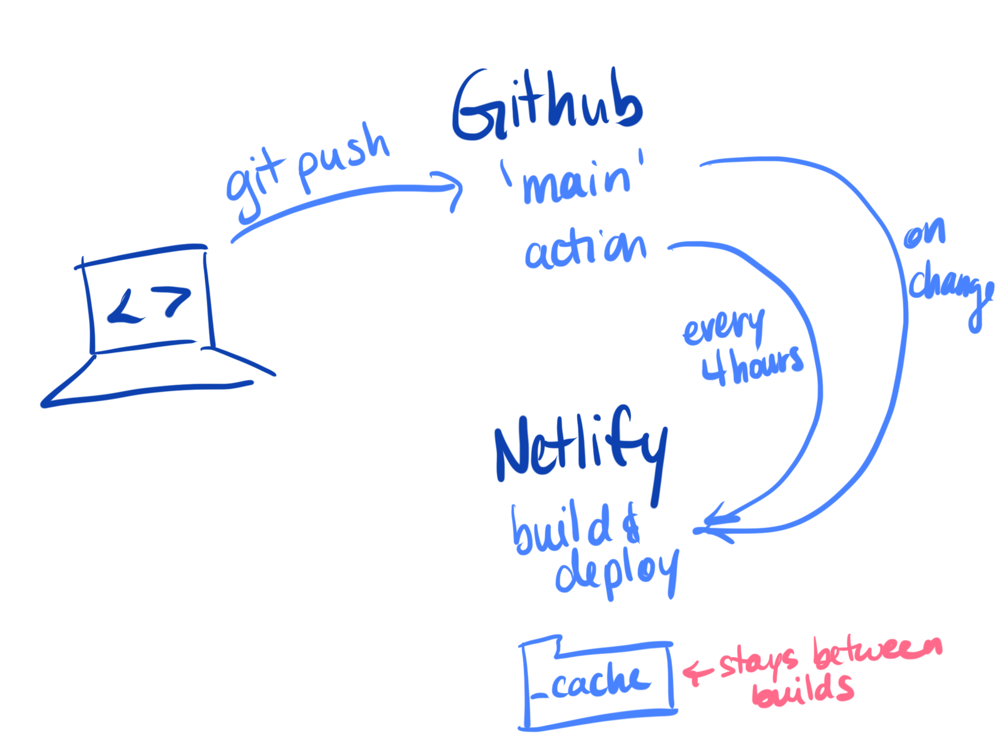
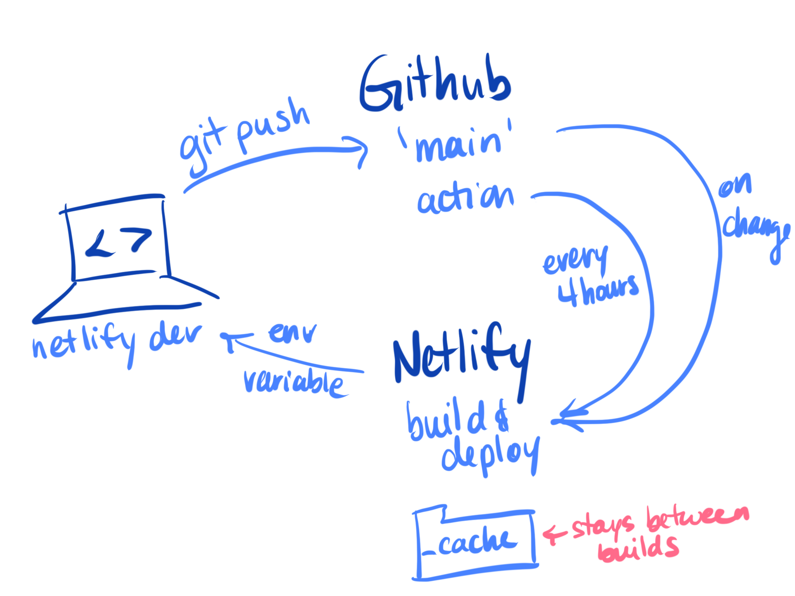

<!-- .slide: data-background="./images/akshar-dave-1GRvY9WUu08-unsplash.jpg" -->
<h1 class="title" style="text-align:left;"><span class="translucent">Measuring</span> JavaScript <span class="translucent">performance</span></h1>
<h2 class="subtitle" style="color:#333;text-align:left;">Sia Karamalegos</h2>

---


<small>I do not know these people. I am not a toast heiress.</small>

---

## hi, i'm sia

[sia.codes](https://sia.codes/)


---

<!-- TODO -->
## []()

---

# Why is performance important?

---


---

<!-- .slide: data-background="./images/lighthouse.jpg" -->

---

# 0.3 - 3.0 seconds

until humans lose focus while waiting

---

# 0.3 seconds

after an interaction until humans perceive poor responsiveness

---

## Core Web Vitals

[image]

---

# Why should I care?

---

<h1 class="align-left"><span class="icons"><i class="far fa-newspaper"></i></h1>

## The Economic Times<!-- .element: class="align-left" -->

<div class="align-left">
  <p class="fragment fade-in-then-semi-out"><span class="icons"><i class="far fa-arrow-down"></i></span> Decreased INP by 75%</p>
  <p class="fragment fade-in-then-semi-out"><span class="icons"><i class="far fa-arrow-down"></i></span> Lowered bounce rate by 50%</p>
  <p class="fragment fade-in-then-semi-out"><span class="icons"><i class="far  fa-arrow-up"></i></span> Increased topics page views by 43%</p>
</div>

---

<h1 class="align-left"><span class="icons"><i class="far fa-bus"></i></h1>

## Redbus<!-- .element: class="align-left" -->

<div class="align-left">
  <p class="fragment fade-in-then-semi-out"><span class="icons"><i class="far fa-arrow-down"></i></span> Decreased INP by 50%</p>
  <p class="fragment fade-in-then-semi-out"><span class="icons"><i class="far  fa-arrow-up"></i></span> Increased conversions by 7.5%</p>
</div>

---

(piggy bank)

---

# Interaction to Next Paint (INP)

---


---

Most of user experience occurs after page load

---

what is it
click, tap, press
associated with rage clicks
< 200ms is good
but target 100ms to be safe (2-5x difference in mobile processor speeds)

---

# Do I have an INP problem?

---

## Real user monitoring (RUM)

add rum pic

---

Crux
web-vitals
Speedcurve

break it down - device, page, etc

---

<span class="icons"><i class="far fa-2x fa-triangle"></i></span>

## Triangulate the source

Use an [INP snippet](https://gist.github.com/tunetheweb/20ffc5719352dd86c215636729760c5c) in Dev Tools or the Chrome [Web Vitals extension](https://web.dev/debug-cwvs-with-web-vitals-extension/
)

---

## Dive deeper in the Performance Panel


[Intro to Runtime Performance in the Chrome DevTools Performance Panel](https://www.youtube.com/watch?v=3_5DKEx72qk) with Annie Sullivan

---

# Recap <!-- .element: class="align-left" -->

<div class="align-left">
  <p class="fragment fade-in-then-semi-out"><span class="icons"><i class="fas fa-sack-dollar"></i></span> Performance is important</p>
  <p class="fragment fade-in-then-semi-out"><span class="icons"><i class="fa fa-stopwatch"></i></span> INP is a new, improved Core Web Vital for JS performance</p>
  <p class="fragment fade-in-then-semi-out"><span class="icons"><i class="fa fa-cocktail"></i></span> Step 1: Use RUM</p>
  <p class="fragment fade-in-then-semi-out"><span class="icons"><i class="fa fa-triangle"></i></span> Step 2: Triangulate with snippet</p>
  <p class="fragment fade-in-then-semi-out"><span class="icons"><i class="fa fa-swimmer"></i></span> Step 3: Dive into the performance panel</p>
</div>

---


<span class="icons"><i class="far fa-2x fa-graduation-cap"></i></span>

## Learn more

- [How to optimize web responsiveness with Interaction to Next Paint](https://www.youtube.com/watch?v=KZ1kxzsJZ5g&t=918s) from Google I/O
- [Digging into Interaction to Next Paint](https://www.youtube.com/watch?v=bDJB-AQDciE) from NY Web Performance meetup
- [Advancing Interaction to Next Paint](https://web.dev/inp-cwv/) from web.dev
- [Optimize Interaction to Next Paint](https://web.dev/optimize-inp/) from web.dev

---

<span class="icons"><i class="far fa-2x fa-laptop"></i>  <i class="far fa-2x fa-ellipsis-h"></i><i class="far fa-2x fa-long-arrow-right"></i> <i class="far fa-2x fa-desktop"></i></span>

> Webmention... enables one website address (URL) to notify another website address that the former contains a reference to the latter.

<small>[Webmentions: Enabling Better Communication on the Internet](https://alistapart.com/article/webmentions-enabling-better-communication-on-the-internet/)</small>

---

<!-- .slide: data-background="./images/duotone-yell.jpg" class="dark-highlight-quote" -->

> When you link to a website, you can send it a Webmention to notify it. If it supports Webmentions, then that website may display your post as a comment, like, or other response, and presto, you’re having a conversation from one site to another! <!-- .element: class="dark-background" -->

<small class="dark-background">[indieweb.org](https://indieweb.org/Webmention)<!-- .element: class="dark-background" --></small>

---

<span class="fa-stack fa-2x icons">
  <i class="far fa-building fa-stack-1x" style="color:#222;"></i>
  <i class="far fa-ban fa-stack-2x"></i>
</span>

> The IndieWeb is a people-focused alternative to the "corporate web".

<small>[indieweb.org](https://indieweb.org/)</small>

---

## Principles of the IndieWeb <!-- .element: class="align-left" -->

<div class="align-left">
  <p class="fragment fade-in-then-semi-out"><span class="icons"><i class="far fa-browser"></i></span> Own your own domain</p>
  <p class="fragment fade-in-then-semi-out"><span class="icons"><i class="far fa-database"></i></span> Own your own content and data</p>
  <p class="fragment fade-in-then-semi-out"><span class="icons"><i class="fab fa-dev"></i></span> Optionally syndicate elsewhere</p>
  <p class="fragment fade-in-then-semi-out"><span class="icons"><i class="far fa-users"></i></span> Connect with everyone, e.g. using webmentions</p>

</div>

---

<!-- .slide: data-background="./images/balloon-feet.jpg" -->

# How does it <br>work?<!-- .element: style="color:#fff;" -->

---



<small>[webmention.io/](https://webmention.io/)</small>

Note: Webmention.io is a hosted service that collects webmention data
---

## webmention.io

Collects webmentions and pingbacks on your behalf

```html
<!-- in <head> of your website: -->
<link rel="webmention" href="https://webmention.io/yourdomain/webmention" />
<link rel="pingback" href="https://webmention.io/yourdomain/abcdefg" />
```

Note: When you sign up for it, you can put these links in the head of your html to collect webmentions. pingbacks are a legacy XML-RPC protocol that existed before webmentions

---

## webmention.io

Send webmentions as a POST request <br> to the webmention endpoint with:
- a source (your URL)
- the target (post you're replying to)

```
curl -si https://webmention.io/yourdomain/webmention \
  -d source=https://yourdomain/page_with_reply.html \
  -d target=https://page_being_replied.com
```

---

Form on my blog pages for people to manually send replies:

```html
<form action="https://webmention.io/sia.codes/webmention" method="post">

  <input type="url" name="source">

  <input type="hidden" name="target"
    value="https://sia.codes/{{ page.url }}">

  <input type="submit">
</form>
```

Note: (explain form). That's cool, but I'm active on Twitter, so I'd really like to bring in that interaction data as webmentions too...

---



<small>[brid.gy/](https://brid.gy/)</small>

Note: Is a service that allows you to easily grab webmentions from these social media platforms as well - for example, Twitter likes, replies, and retweets.

---



Note: This is what it looks like when I log in with Twitter and look at my bridgy data.

---

## Set up Webmention Services

<span class="icons"><i class="fas fa-2x fa-concierge-bell"></i></span>

<ol>
  <li class="fragment fade-in-then-semi-out">Set up <a href="https://indieauth.com/setup">IndieAuth</a> so you can log in with your domain.</li>
  <li class="fragment fade-in-then-semi-out">Sign in on <a href="https://webmention.io/">webmention.io</a> to get your link tags so webmention.io can collect webmentions for your site.</li>
  <li class="fragment fade-in-then-semi-out">Securely save your webmention.io API key.</li>
  <li class="fragment fade-in-then-semi-out">Optionally sign up for a social media webmention service like <a href="https://brid.gy/">Bridgy</a>.</li>
</ol>

Note: I didn't know about Netlify-cli when I wrote the post - that is a better option for managing env variables.

---

<!-- .slide: data-background="./images/duotone-road.jpg" -->

# Eleventy <!-- .element: class="dark-background" -->

Note: Duotone possum... we're on the road to Eleventy now

---

## 🤘 Eleventy Rocks 🤘

<div class="align-left">
  <p class="fragment fade-in-then-semi-out"><span class="icons"><i class="fab fa-node-js"></i></span> Node-based static site generator</p>
  <p class="fragment fade-in-then-semi-out"><span class="icons"><i class="fab fa-osi"></i></span> Non-corporate and open source</p>
  <p class="fragment fade-in-then-semi-out"><span class="icons"><i class="fas fa-tachometer-alt"></i></span> Requires no client-side JS</p>
  <p class="fragment fade-in-then-semi-out"><span class="icons"><i class="far fa-folder-open"></i></span> Folder/file-based API</p>
  <p class="fragment fade-in-then-semi-out"><span class="icons"><i class="fas fa-ice-cream"></i></span> Can use markdown, Liquid, Nunjucks, Pug, Handlebars, etc. out of the box</p>

</div>

---

# DEMO

[sia.codes/posts/itsiest-bitsiest-eleventy-tutorial/](https://sia.codes/posts/itsiest-bitsiest-eleventy-tutorial/)

---

## Some fav features

- Generating pages based on a data set, e.g. my [game pages](https://games.sia.codes/terraforming-mars/)
- Creating layouts within layouts and template partials
- Using filters and shortcodes for reusability

---



<small>[An In-Depth Tutorial of Webmentions + Eleventy](https://sia.codes/posts/webmentions-eleventy-in-depth/) on sia.codes</small>

Note: This talk won't be an in-depth tutorial - we'll focus on the high-level how. The good news is I already have a detailed tutorial published!

---

## The Process <span class="icons"><i class="far fa-project-diagram"></i></span>

- In production, fetch new webmentions during the build<!-- .element: class="fragment fade-in-then-semi-out" -->
- Store them in a cache file<!-- .element: class="fragment fade-in-then-semi-out" -->
- Render the webmentions<!-- .element: class="fragment fade-in-then-semi-out" -->
- Set up periodic builds<!-- .element: class="fragment fade-in-then-semi-out" -->

---

## Oh so serverless



---

## Oh so serverless



---

## Oh so serverless



---

## Oh so serverless



---

## Fetch new webmentions

&nbsp;

```javascript
// `since` comes from the `lastFetched` attribute in our cache file
const API = 'https://webmention.io/api'
const url = `${API}/mentions.jf2?domain=${domain}&token=${TOKEN}
  &per-page=${perPage}&since=${since}`
// ...
```
&nbsp;

<small>**Prior art**: I started with Max Böck's post [Static Indieweb pt2: Using Webmentions](https://mxb.dev/blog/using-webmentions-on-static-sites/) and the code for Zach Leatherman's [personal site](https://github.com/zachleat/zachleat.com), sprinkled in microformats from Keith Grant's [Adding Webmention Support to a Static Site](https://keithjgrant.com/posts/2019/02/adding-webmention-support-to-a-static-site/), and made my own changes.</small>

---

## Write to cache file

```javascript
// save combined webmentions in cache file (simplified)
function writeToCache(data) {
  const dir = '_cache'
  const fileContent = JSON.stringify(data, null, 2)

  // write data to cache json file
  fs.writeFile(CACHE_FILE_PATH, fileContent, err => {
    if (err) throw err
    console.log(`>>> webmentions cached to ${CACHE_FILE_PATH}`)
  })
}
```

---

## Set up Netlify cache plugin

Cache the `/_cache/` folder between builds<br>
with [netlify-plugin-cache-folder](https://github.com/siakaramalegos/netlify-plugin-cache-folder)

```
npm install -D netlify-plugin-cache-folder
```

netlify.toml
```toml
[build]
  command   = "npm run build"

[[plugins]]
  package = "netlify-plugin-cache-folder"
```

---

## Render webmentions: Filters

New Nunjucks [filters](https://mozilla.github.io/nunjucks/templating.html#filters) for handling the data:

```javascript
function getWebmentionsForUrl (webmentions, url) {
  return webmentions.children.filter(entry => {
    return entry['wm-target'] === url
  })
}

function size (mentions) {
  return !mentions ? 0 : mentions.length
}

function webmentionsByType (mentions, mentionType) {
  return mentions.filter(entry => !!entry[mentionType])
}
```

---

## Render webmentions: Template

Set all the variables needed:

```html
<!-- _includes/webmentions.njk -->

<!-- Filter the cached mentions for the post's url -->

<!-- Set likes as mentions that are `like-of`  -->

<!-- Count the total likes -->

<!-- Set replies as mentions that are `in-reply-to`  -->

<!-- Count the total replies -->


<!-- ... -->
```

---

## Render webmentions: Loop through data

```html
<!-- _includes/webmentions.njk -->

<!-- ... -->

<div class="webmention-replies">
  <h3>{{ repliesSize }} ReplyReplies</h3>
  
    
  
</div>

```

---

## Render webmentions

```html
<!-- _includes/webmention.njk - simplified -->
<article>
  
    <strong class="p-name">{{ webmention.author.name }}</strong>
  
    <strong>Anonymous</strong>
  

  <p>
    {{ webmention.content.text | truncate }}
    
      <a href="{{ webmention.url }}">source</a>
    
  </p>
</article>
```

---

## Fake Netlify cron jobs with GitHub actions!

```yaml
# .github/workflows/build-scheduler.yml
name: Scheduled build
on:
  schedule:
  # At minute 20 past every 4th hour from 0 through 23.
  - cron: '20 0/4 * * *'
jobs:
  build:
    runs-on: ubuntu-latest
    steps:
    - name: Trigger our build webhook on Netlify
      run: curl -s -X POST "https://api.netlify.com/build_hooks/${TOKEN}"
      env:
        TOKEN: ${{ secrets.NETLIFY_BUILD_TOKEN }}
```

<small>[Scheduling Netlify deploys with GitHub Actions](https://www.voorhoede.nl/en/blog/scheduling-netlify-deploys-with-github-actions/), [crontab guru](https://crontab.guru/#15_0/3_*_*_*)</small>

---

<!-- .slide: data-background="./images/duotone-small-hiss.jpg" -->
# 🎉<!-- .element: style="font-size:4em;" -->

---

<!-- .slide: data-background="./images/akshar-dave-1GRvY9WUu08-unsplash.jpg" -->
<h1 class="title" style="text-align:left;">Thanks!</h1>

<p style="color:#333;text-align:left;">Slides:<br> <a href="https://sia.codes/posts/webmentions-eleventy-talk/" class="link-secondary">sia.codes/posts/webmentions<br>-eleventy-talk/</a></p>
<p style="color:#333;text-align:left;">Tutorial:<br> <a href="https://sia.codes/posts/webmentions-eleventy-in-depth/" class="link-secondary">sia.codes/posts/webmentions<br>-eleventy-in-depth/</a></p>
<p style="color:#333;text-align:left;">Writing, resources, and more:<br> <a href="https://sia.codes/" class="link-secondary">sia.codes</a></p>

---

## Photo credits

- Balloons <span>Photo by <a href="https://unsplash.com/@buco_balkanessi?utm_source=unsplash&amp;utm_medium=referral&amp;utm_content=creditCopyText">Bucography</a> on <a href="https://unsplash.com/?utm_source=unsplash&amp;utm_medium=referral&amp;utm_content=creditCopyText">Unsplash</a></span>
- Heart balloons <span>Photo by <a href="https://unsplash.com/@akshar_dave?utm_source=unsplash&amp;utm_medium=referral&amp;utm_content=creditCopyText">Akshar Dave</a> on <a href="https://unsplash.com/?utm_source=unsplash&amp;utm_medium=referral&amp;utm_content=creditCopyText">Unsplash</a></span>
- Balloon and feet dangling - <span>Photo by <a href="https://unsplash.com/@edrecestansberry?utm_source=unsplash&amp;utm_medium=referral&amp;utm_content=creditCopyText">Edrece Stansberry</a> on <a href="https://unsplash.com/?utm_source=unsplash&amp;utm_medium=referral&amp;utm_content=creditCopyText">Unsplash</a></span>
- Lighthouse - Photo by <a href="https://unsplash.com/fr/@tamal_mukherjee?utm_source=unsplash&utm_medium=referral&utm_content=creditCopyText">Tamal Mukhopadhyay</a> on <a href="https://unsplash.com/images/things/lighthouse?utm_source=unsplash&utm_medium=referral&utm_content=creditCopyText">Unsplash</a>
