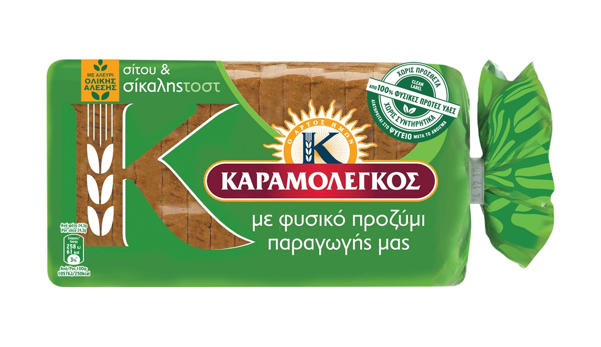
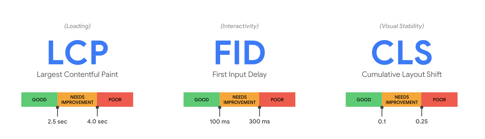
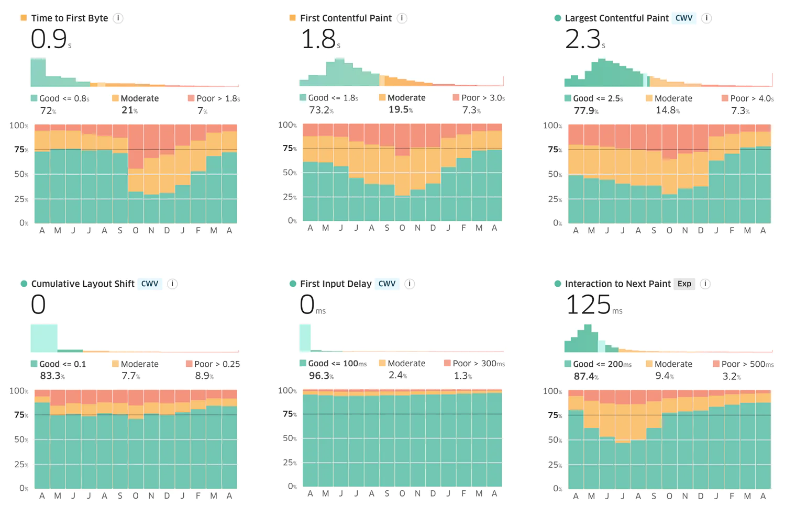
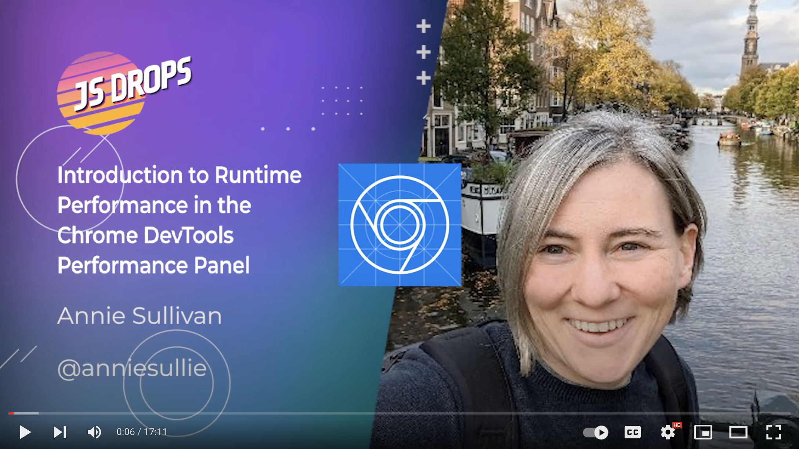

<!-- .slide: data-background="./images/akshar-dave-1GRvY9WUu08-unsplash.jpg" -->
<h1 class="title" style="text-align:left;">Measuring JavaScript performance</h1>
<h2 class="subtitle" style="color:#333;text-align:left;">Sia Karamalegos</h2>

---

<!-- .slide: data-background="./images/akshar-dave-1GRvY9WUu08-unsplash.jpg" -->
<h1 class="title" style="text-align:left;">Measuring JavaScript performance</h1>
<h2 class="subtitle" style="color:#333;text-align:left;"><del>Sia Karamalegos</del>  Aspasia Karamolegkou</h2>

---

<small>I do not know these people. I am not a toast heiress.</small>

---

## hi, i'm sia

[sia.codes](https://sia.codes/)

---

<!-- TODO -->
## [measure-js-perf.netlify.app](https://measure-js-perf.netlify.app/#/)

---

<!-- .slide: data-background="./images/madison-oren-uGP_6CAD-14-unsplash.jpg" -->
<h1 class="highlighter-light">Why is performance important?</h1>

---

<!-- .slide: data-background="./images/lighthouse.jpg" -->

Note: as my friend x likes to say, no one goes to a website and thinks wow this must have a great lighthouse score. True, but performance is not lighthouse

---

Performance impacts user experience.

---

# 0.3 - 3.0 seconds

until humans lose focus while waiting

---

# 0.3 seconds

after an interaction until humans perceive poor responsiveness

---

## The Core Web Vitals

---

<!-- .slide: data-background="./images/ave-calvar-Ppj9o_x_e-4-unsplash.jpg" -->
<h1 class="highlighter-light">Why should I care?</h1>

---

<h1 class="align-left"><i class="far fa-newspaper"></i></h1>

## The Economic Times<!-- .element: class="align-left" -->

  
<i class="far fa-arrow-down"></i> Decreased INP by 75%

  
<i class="far fa-arrow-down"></i> Lowered bounce rate by 50%

  
<i class="far  fa-arrow-up"></i> Increased topics page views by 43%

---

<h1 class="align-left"><i class="far fa-bus"></i></h1>

## Redbus<!-- .element: class="align-left" -->

  
<i class="far fa-arrow-down"></i> Decreased INP by 50%

  
<i class="far  fa-arrow-up"></i> Increased conversions by 7.5%

---

<!-- .slide: data-background="./images/saving-money-piggy-bank.jpg" -->

---

Note: But target 100ms to be safe (2-5x difference in mobile processor speeds)

---

Most of user experience occurs after page load.

---

Note: click, tap, press; associated with rage clicks

---

<!-- .slide: data-background="./images/bernard-hermant-bSpqe48INMg-unsplash.jpg" -->
# Do I have an INP problem?<!-- .element: class="highlighter" style="color:#e0db8f" -->

---

## Debugging INP <!-- .element: class="align-left" -->

  
<i class="fa fa-cocktail"></i> Step 1: Use RUM

  
<i class="fa fa-triangle"></i> Step 2: Triangulate with snippet

  
<i class="fa fa-swimmer"></i> Step 3: Dive into the performance panel

---

## <i class="fa fa-cocktail"></i> Real user monitoring (RUM)

---

## <i class="fa fa-cocktail"></i> Real user monitoring (RUM)

- [Chrome User Experience Report (CrUX)](https://developer.chrome.com/docs/crux/) - [TREO](https://treo.sh/sitespeed), [PageSpeed Insights](https://pagespeed.web.dev/)
- [web-vitals npm package](https://github.com/GoogleChrome/web-vitals), send to your analytics
- [Speedcurve](https://www.speedcurve.com/)

<small>Slice the data to find the worst offending pages and device types.</small>

---

## <i class="fa fa-triangle"></i> Triangulate the source

Use an [INP snippet](https://gist.github.com/tunetheweb/20ffc5719352dd86c215636729760c5c) in Dev Tools or the Chrome [Web Vitals extension](https://web.dev/debug-cwvs-with-web-vitals-extension/
)

<small>Check out more web perf snippets in this <a href="https://github.com/nucliweb/webperf-snippets">repo</a>.</small>

---

## <i class="fa fa-swimmer"></i> Dive deeper in the Performance Panel

[Intro to Runtime Performance in the Chrome DevTools Performance Panel](https://www.youtube.com/watch?v=3_5DKEx72qk) with Annie Sullivan

---

# Recap <!-- .element: class="align-left" -->

  
<i class="fas fa-sack-dollar"></i> Performance is important

  
<i class="fa fa-stopwatch"></i> INP is a new, improved Core Web Vital for JS performance

  
<i class="fa fa-cocktail"></i> Step 1: Use RUM

  
<i class="fa fa-triangle"></i> Step 2: Triangulate with snippet

  
<i class="fa fa-swimmer"></i> Step 3: Dive into the performance panel

---

<i class="far fa-2x fa-graduation-cap"></i>

## Learn more

- [How to optimize web responsiveness with Interaction to Next Paint](https://www.youtube.com/watch?v=KZ1kxzsJZ5g&t=918s) from Google I/O
- [Digging into Interaction to Next Paint](https://www.youtube.com/watch?v=bDJB-AQDciE) from NY Web Performance meetup
- [Advancing Interaction to Next Paint](https://web.dev/inp-cwv/) from web.dev
- [Optimize Interaction to Next Paint](https://web.dev/optimize-inp/) from web.dev
- [Intro to Runtime Performance in the Chrome DevTools Performance Panel](https://www.youtube.com/watch?v=3_5DKEx72qk) with Annie Sullivan
- [3 ways to find your worst JavaScript offenders for page load](https://performance.shopify.com/blogs/blog/3-ways-to-find-your-worst-javascript-offenders-for-page-load)

---

<!-- .slide: data-background="./images/akshar-dave-1GRvY9WUu08-unsplash.jpg" -->
<h1 class="title" style="text-align:left;">Thanks!</h1>

Slides:  <a href="https://measure-js-perf.netlify.app/#/" class="link-secondary">measure-js-perf.netlify.app</a>

Writing, resources, and more:  <a href="https://sia.codes/" class="link-secondary">sia.codes</a>

---

## Photo credits

- Balloons Photo by <a href="https://unsplash.com/@buco_balkanessi?utm_source=unsplash&amp;utm_medium=referral&amp;utm_content=creditCopyText">Bucography</a> on <a href="https://unsplash.com/?utm_source=unsplash&amp;utm_medium=referral&amp;utm_content=creditCopyText">Unsplash</a>
- Heart balloons Photo by <a href="https://unsplash.com/@akshar_dave?utm_source=unsplash&amp;utm_medium=referral&amp;utm_content=creditCopyText">Akshar Dave</a> on <a href="https://unsplash.com/?utm_source=unsplash&amp;utm_medium=referral&amp;utm_content=creditCopyText">Unsplash</a>
- Balloon and feet dangling - Photo by <a href="https://unsplash.com/@edrecestansberry?utm_source=unsplash&amp;utm_medium=referral&amp;utm_content=creditCopyText">Edrece Stansberry</a> on <a href="https://unsplash.com/?utm_source=unsplash&amp;utm_medium=referral&amp;utm_content=creditCopyText">Unsplash</a>
- Lighthouse - Photo by <a href="https://unsplash.com/fr/@tamal_mukherjee?utm_source=unsplash&utm_medium=referral&utm_content=creditCopyText">Tamal Mukhopadhyay</a> on <a href="https://unsplash.com/images/things/lighthouse?utm_source=unsplash&utm_medium=referral&utm_content=creditCopyText">Unsplash</a>
- Smiley balloons Photo by <a href="https://unsplash.com/@artbyhybrid?utm_source=unsplash&utm_medium=referral&utm_content=creditCopyText">Madison Oren</a> on <a href="https://unsplash.com/s/photos/think?orientation=landscape&utm_source=unsplash&utm_medium=referral&utm_content=creditCopyText">Unsplash</a>
- Purple heart ballons photo by Ave Calvar on [Unsplash](https://unsplash.com/photos/Ppj9o_x_e-4)
- Grimace balloon photo by Bernard Hermant on [Unsplash](https://unsplash.com/photos/bSpqe48INMg)
